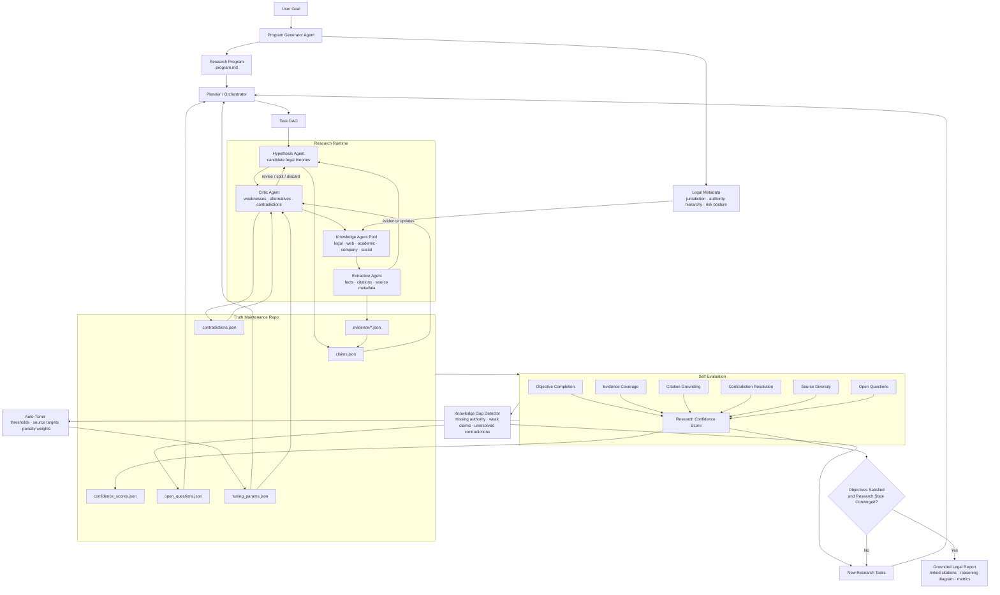

# AutoResearch OS

AutoResearch OS is a legal autoresearch runtime for the Modal Autoresearch Systems Hackathon. It turns a user goal into an executable research program, runs specialized agents through an iterative control loop, maintains a persistent truth repository, evaluates convergence, and emits a grounded report with citations, metrics, and a reasoning trace.

The prototype is intentionally narrowed to legal research. Each run records legal metadata such as jurisdiction, practice area, authority hierarchy, required source types, citation policy, risk posture, and uncertainty policy.

## The Idea

AutoResearch OS is not just an agent with memory. It is a research control system that keeps improving a structured research state until measurable objectives are satisfied.

```text
Research
-> Truth Maintenance
-> Self Evaluation
-> Knowledge Gap Detection
-> New Research Tasks
-> Research Again
```

The final output is not only an answer. It is a report backed by claims, evidence, contradictions, confidence scores, source links, agent traces, and stop-condition metrics.

## What Makes It Different

- A central reasoning LLM coordinates the legal research process by default.
- Role agents are explicit tool-using workers, not anonymous programming threads.
- A truth-maintenance repo stores claims, evidence, contradictions, confidence, open questions, and tuning parameters.
- The evaluator scores objective completion, citation grounding, evidence coverage, contradiction resolution, source diversity, and open questions.
- A knowledge-gap detector converts weak research states into new tasks.
- Tuning parameters adapt over time when the evaluator finds weak evidence, unresolved contradictions, or insufficient primary authority.

## Quickstart

Install the project:

```bash
python -m venv .venv
source .venv/bin/activate
pip install -e ".[dev]"
```

Run the built-in legal demo with central LLM reasoning:

```bash
export OPENAI_API_KEY="..."
autoresearch demo --out demo_gt_repo
```

`OPEN_API_KEY` is also accepted for local experiments. LLM reasoning is the default; if no key is available, the CLI fails loudly instead of silently falling back.

Run without installing:

```bash
export OPENAI_API_KEY="..."
PYTHONPATH=src python -m autoresearch_os.cli demo --out demo_gt_repo
```

Run deterministic fallback mode for offline tests or no-key demos:

```bash
PYTHONPATH=src python -m autoresearch_os.cli demo --offline --no-llm --out demo_gt_repo
```

Run your own legal question:

```bash
autoresearch run \
  "Can AI-generated code be copyrighted in the United States, and what legal risks would a startup face if it relies heavily on AI-generated software?" \
  --out gt_repo \
  --max-iterations 4
```

Add extra sources:

```bash
autoresearch run \
  "Can AI-generated code be copyrighted in the United States?" \
  --source-url https://www.example.com/legal-source \
  --out gt_repo
```

## Architecture

### High-Level Loop


### Runtime Detail



The hypothesis, critic, and knowledge agents form an inner feedback loop. Hypotheses are challenged by the critic, tested by knowledge agents, updated from extracted evidence, and revised before the truth repo is evaluated.

## Agents

The current runtime exposes these agent roles:

- `program_generator`: creates the legal research program and metadata.
- `planner_orchestrator`: turns the program into task structure.
- `hypothesis_agent`: generates and refines candidate legal theories.
- `knowledge_agent_pool`: retrieves and structures evidence from live or fallback sources.
- `critic_agent`: attacks claims, finds contradictions, and raises weaknesses.
- `evaluator_agent`: scores the research state against convergence criteria.
- `knowledge_gap_detector`: creates follow-up tasks from weak or missing knowledge.
- `auto_tuner`: adjusts thresholds and source requirements over time.
- `report_generator`: produces Markdown, HTML, and PDF reports.

Agent traces are written into `metrics.json` and shown in the CLI and HTML report, including tools used, loop steps, output counts, and whether LLM reasoning was used.

## Truth-Maintenance Repo

Each run writes a complete research state:

```text
gt_repo/
  program.md
  legal_metadata.json
  tuning_params.json
  tasks.json
  entities.json
  hypotheses.json
  claims.json
  evidence/
  contradictions.json
  confidence_scores.json
  metrics.json
  open_questions.json
  evals/
  final_report.md
  final_report.html
  final_report.pdf
```

The HTML report is the primary demo artifact. It includes paper-style linked citations, a reasoning/rationale diagram, component-level metrics, convergence progress, hypothesis confidence, contradiction analysis, source anchors, and agent tool loops.

## Retrieval

Knowledge agents can fetch real external sources using dependency-free HTTP retrieval. The built-in legal source set includes public authorities such as Federal Register copyright guidance, the U.S. Copyright Office AI page, and 17 U.S.C. Section 102 via Cornell LII.

Every run records retrieval metrics:

- live retrieval enabled or disabled
- URLs attempted and retrieved
- failed URLs and error classes
- fallback evidence usage
- retrieved source URLs

## Evaluation And Convergence

The evaluator tracks:

- objective completion
- evidence coverage
- citation grounding
- contradiction resolution
- source diversity
- open questions
- final confidence

The runtime stops when the research program is satisfied:

```text
Objective Completion >= 90%
Citation Grounding >= 90%
Overall Confidence >= 85%
Critical Open Questions <= 2
Contradiction Resolution >= 80%
```

If the state has not converged, the knowledge-gap detector creates follow-up tasks and the runtime loops again.

## Legal Metadata And Tuning

Legal quality depends on different assumptions than generic web research. AutoResearch OS records those assumptions in `program.md` and `legal_metadata.json`:

- jurisdiction and practice area
- legal authority hierarchy
- required primary source types
- citation style
- risk posture and uncertainty policy

The runtime persists tunable constants in `tuning_params.json`, including:

- `supported_claim_threshold`
- `contradiction_penalty_weight`
- `min_primary_sources`
- `target_source_diversity`
- `gap_task_limit`
- `evaluator_weights`

After each evaluation, the tuner nudges these values when the research state is weak. For example, low citation grounding raises the support threshold and primary-source requirement; low contradiction resolution increases contradiction penalties; too many open questions expands gap-task generation.

## Metrics

The CLI, `metrics.json`, Markdown report, HTML report, and PDF report include:

- agents spun off and agent-by-agent breakdown
- hypotheses, tasks, claims, evidence records, source categories, contradictions, and open questions
- iterations completed
- component runtimes
- retrieval metrics
- agent tool-loop traces
- final confidence
- stop-condition status

## Modal Hook

`modal/app.py` contains a lightweight Modal entrypoint sketch for parallel evidence collection. It is isolated from the local runtime so the CLI demo remains dependency-free.

## Development

```bash
pytest
```
