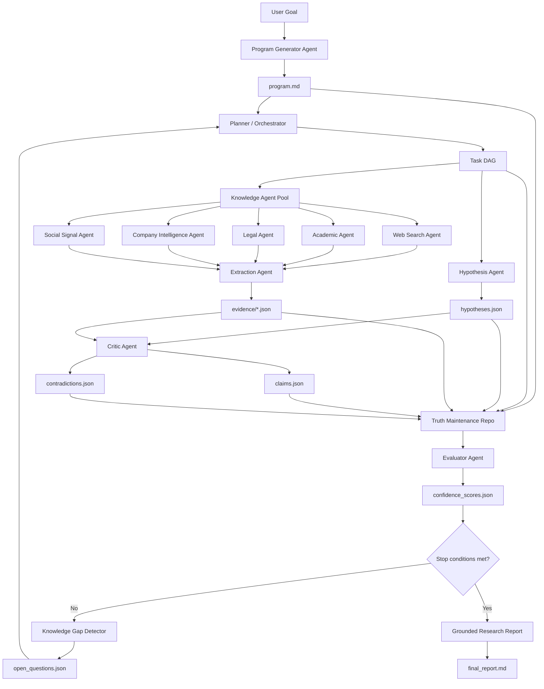

# AutoResearch OS

AutoResearch OS is a self-evaluating autonomous research runtime with a truth-maintenance repo. This hackathon prototype turns a user goal into an executable research program, runs an iterative control loop, stores every artifact in a truth-maintenance repo, evaluates convergence, detects knowledge gaps, and emits a grounded research report.

The key idea: do not optimize for an immediate answer. Optimize for a maintained research state with evidence, contradictions, confidence scores, and explicit stop conditions.

## Why This Fits The Hackathon

The Autoresearch Systems Hackathon asks for systems that help agents iteratively plan, search, and synthesize information over extended horizons. This repo focuses on:

- Agent architectures and control loops
- Retrieval and knowledge synthesis
- Citation-grounded reports
- Self-evaluation and stopping criteria
- A persistent truth-maintenance repository

## Architecture



## Quickstart

```bash
python -m venv .venv
source .venv/bin/activate
pip install -e ".[dev]"

autoresearch run \
  "Can AI-generated code be copyrighted in the United States, and what legal risks would a startup face if it relies heavily on AI-generated software?" \
  --out gt_repo \
  --max-iterations 4
```

Or without installing:

```bash
PYTHONPATH=src python -m autoresearch_os.cli run \
  "Can AI-generated code be copyrighted in the United States?" \
  --out gt_repo
```

## Outputs

Each run writes a complete research state:

```text
gt_repo/
  program.md
  tasks.json
  entities.json
  hypotheses.json
  claims.json
  evidence/
  contradictions.json
  confidence_scores.json
  open_questions.json
  evals/
  final_report.md
```

## Demo

```bash
PYTHONPATH=src python -m autoresearch_os.cli demo --out demo_gt_repo
```

Then open `demo_gt_repo/final_report.md`.

## Current Prototype Scope

This implementation ships with deterministic baseline agents so it can run live without API keys or network access. The knowledge layer includes a small legal-domain evidence fixture for the demo query and a general extraction path for local seed text. The agent interfaces are intentionally narrow, making it straightforward to swap in web search, legal search, academic search, OpenAI model calls, or Modal fan-out workers.

## Modal Hook

`modal/app.py` contains a lightweight Modal entrypoint sketch for parallel evidence collection. It is intentionally isolated so the local demo remains dependency-free.

## Development

```bash
pytest
```
