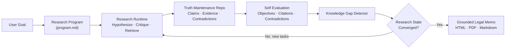
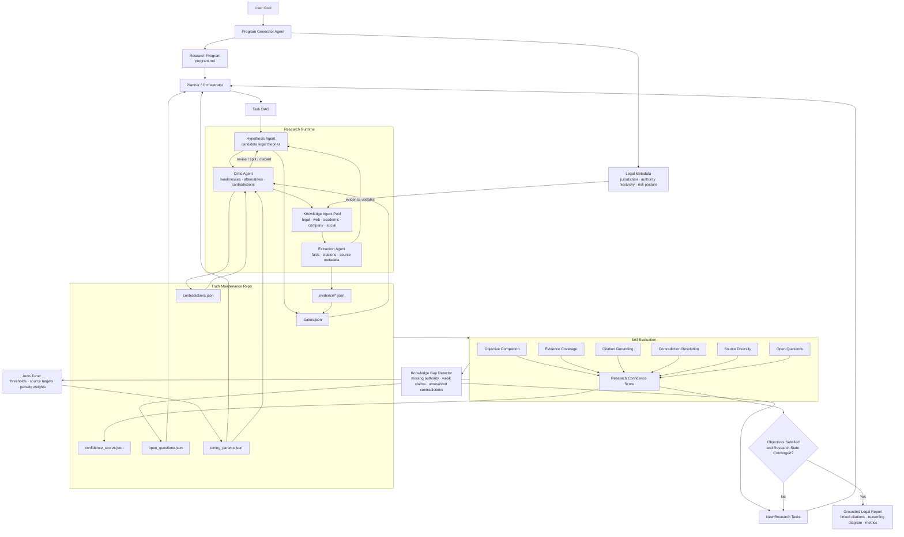

# Legal AutoResearch OS

Legal AutoResearch OS is a legal research control system for the Modal Autoresearch Systems Hackathon. It turns a legal question into an executable research program, runs specialized agents through hypothesis/evidence/critic loops, maintains a persistent truth repository, evaluates convergence, and emits a grounded legal memo with citations, metrics, and a reasoning trace.

The prototype is intentionally narrowed to legal research. Each run records legal metadata such as jurisdiction, practice area, authority hierarchy, required source types, citation policy, risk posture, and uncertainty policy.

## The Idea

Legal AutoResearch OS is not just an agent with memory. It is a research control system that keeps improving a structured legal research state until measurable objectives are satisfied.

```text
Research
-> Truth Maintenance
-> Self Evaluation
-> Knowledge Gap Detection
-> New Research Tasks
-> Research Again
```

The final output is not only an answer. It is a report backed by claims, evidence, contradictions, confidence scores, source links, agent traces, and stop-condition metrics.

## What Makes It Different

- A central OpenAI Agents SDK reasoning layer coordinates the legal research process by default.
- Role agents are explicit tool-using workers, not anonymous programming threads.
- A truth-maintenance repo stores claims, evidence, contradictions, confidence, open questions, and tuning parameters.
- The evaluator scores objective completion, citation grounding, evidence coverage, contradiction resolution, source diversity, and open questions.
- A knowledge-gap detector converts weak research states into new tasks.
- Tuning parameters adapt over time when the evaluator finds weak evidence, unresolved contradictions, or insufficient primary authority.

## Quickstart

Install the project:

```bash
python -m venv .venv
source .venv/bin/activate
pip install -e ".[dev]"
```

Run the built-in legal demo with OpenAI Agents SDK reasoning:

```bash
export OPENAI_API_KEY="..."
autoresearch demo --out demo_gt_repo
```

`OPEN_API_KEY` is also accepted for local experiments. OpenAI Agents SDK reasoning is the default; if no key is available, the CLI fails loudly instead of silently falling back.

Run without installing:

```bash
export OPENAI_API_KEY="..."
PYTHONPATH=src python -m autoresearch_os.cli demo --out demo_gt_repo
```

Run deterministic fallback mode for offline tests or no-key demos:

```bash
PYTHONPATH=src python -m autoresearch_os.cli demo --offline --no-llm --out demo_gt_repo
```

Trace a local run in Raindrop Workshop:

```bash
pip install -e ".[dev,raindrop]"
raindrop workshop setup
PYTHONPATH=src python -m autoresearch_os.cli demo --offline --no-llm --raindrop --out demo_gt_repo
```

Workshop shows the research loop as tool spans: program generation, planning, hypothesis generation, retrieval, claim synthesis, criticism, evaluation, tuning, and report generation. This is the easiest way to inspect why confidence changed or why a source was blocked.

Control the inner hypothesis/knowledge/critic feedback loop:

```bash
PYTHONPATH=src python -m autoresearch_os.cli demo --feedback-rounds 2 --out demo_gt_repo
```

Run your own legal question:

```bash
autoresearch run \
  "Can AI-generated code be copyrighted in the United States, and what legal risks would a startup face if it relies heavily on AI-generated software?" \
  --out gt_repo \
  --max-iterations 4
```

Add extra sources:

```bash
autoresearch run \
  "Can AI-generated code be copyrighted in the United States?" \
  --source-url https://www.example.com/legal-source \
  --out gt_repo
```

Run live retrieval on Modal for faster source fan-out:

```bash
pip install -e ".[dev,modal]"
modal setup
export OPENAI_API_KEY="..."
autoresearch demo --modal --out demo_gt_repo
```

For a fast retrieval-only smoke test:

```bash
modal run modal/app.py
```

## Architecture

### High-Level Loop



### Runtime Detail



The hypothesis, critic, and knowledge agents form an inner feedback loop. Hypotheses are challenged by the critic, tested by knowledge agents, updated from extracted evidence, and revised before the truth repo is evaluated. `--feedback-rounds` is reserved for contradiction-driven refinement; ordinary open questions become follow-up tasks in the outer loop so the runtime does not repeat expensive retrieval work unnecessarily.

## Agents

The current runtime exposes these agent roles:

- `program_generator`: creates the legal research program and metadata.
- `planner_orchestrator`: turns the program into task structure.
- `hypothesis_agent`: generates and refines candidate legal theories.
- `hypothesis_refinement_agent`: revises hypotheses from critic findings, contradictions, and knowledge gaps.
- `knowledge_agent_pool`: retrieves and structures evidence from live or fallback sources.
- `modal_url_fetch_agent`: when `--modal` is enabled, fans out URL fetch/extract jobs on Modal.
- `critic_agent`: attacks claims, finds contradictions, and raises weaknesses.
- `evaluator_agent`: scores the research state against convergence criteria.
- `knowledge_gap_detector`: creates follow-up tasks from weak or missing knowledge.
- `auto_tuner`: adjusts thresholds and source requirements over time.
- `report_generator`: produces Markdown, HTML, and PDF reports.

Each role agent has deterministic tools plus an OpenAI Agents SDK reasoning call. The local runtime owns orchestration and state, while SDK `Agent` instances perform the compact JSON reasoning steps for hypothesis refinement, evidence review, and criticism. Agent traces are written into `metrics.json` and shown in the CLI and HTML report, including tools used, loop steps, output counts, and whether LLM reasoning was used.

## Truth-Maintenance Repo

Each run writes a complete research state:

```text
gt_repo/
  program.md
  legal_metadata.json
  tuning_params.json
  tasks.json
  entities.json
  hypotheses.json
  claims.json
  evidence/
  contradictions.json
  confidence_scores.json
  metrics.json
  raindrop_feedback.json
  open_questions.json
  evals/
  final_report.md
  final_report.html
  final_report.pdf
```

The HTML report is the primary demo artifact. It includes paper-style linked citations, a reasoning/rationale diagram, component-level metrics, convergence progress, hypothesis confidence, contradiction analysis, source anchors, and agent tool loops.

## Retrieval

Knowledge agents can fetch real external sources using dependency-free HTTP retrieval. For live runs, the retrieval planner builds legal web-search queries from the objective and hypotheses, expands blocked search results with curated legal-source fallbacks, deduplicates candidate URLs, fetches sources, and assigns relative reliability/relevance scores. Copyright-specific built-ins are used only for copyright/authorship questions.

Every run records retrieval metrics:

- live retrieval enabled or disabled
- web search enabled, search queries, and discovered URLs
- URLs attempted and retrieved
- relative source scores
- failed URLs and error classes
- Modal URL fetch-agent count when `--modal` is enabled
- fallback evidence usage
- retrieved source URLs

## Evaluation And Convergence

The evaluator tracks:

- objective completion
- evidence coverage
- citation grounding
- contradiction resolution
- source diversity
- open questions
- final confidence

Scoring has two layers:

1. A deterministic base score combines objective completion, evidence coverage, source diversity, contradiction resolution, citation grounding, mean claim confidence, primary-authority coverage, and confidence stability. It subtracts penalties for open questions and blocked sources, then applies confidence caps for thin or weak evidence.
2. When LLM reasoning is enabled, the central `evaluator_agent` performs a bounded scoring audit. It checks whether the claims actually answer the objective and whether cited excerpts support those claims. The LLM can adjust the deterministic score by at most `-8%` to `+4%`, and positive adjustments are blocked when open questions remain.

The report and `metrics.json` record deterministic confidence, LLM adjustment, final confidence, and the LLM scoring rationale when the audit runs.

The runtime stops when the research program is satisfied:

```text
Objective Completion >= 90%
Citation Grounding >= 90%
Overall Confidence >= 85%
Critical Open Questions <= 2
Contradiction Resolution >= 80%
```

If the state has not converged, the knowledge-gap detector creates follow-up tasks and the runtime loops again.

The runtime also stops early when the research state plateaus: if confidence, evidence count, and open-question count stop improving, the iteration status becomes `Plateau` and the report is generated instead of spending more time on repeated retrieval.

## Legal Metadata And Tuning

Legal quality depends on different assumptions than generic web research. Legal AutoResearch OS records those assumptions in `program.md` and `legal_metadata.json`:

- jurisdiction and practice area
- legal authority hierarchy
- required primary source types
- citation style
- risk posture and uncertainty policy

The runtime persists tunable constants in `tuning_params.json`, including:

- `supported_claim_threshold`
- `contradiction_penalty_weight`
- `min_primary_sources`
- `target_source_diversity`
- `gap_task_limit`
- `evaluator_weights`

After each evaluation, the tuner nudges these values when the research state is weak. For example, low citation grounding raises the support threshold and primary-source requirement; low contradiction resolution increases contradiction penalties; too many open questions expands gap-task generation.

## Metrics

The CLI, `metrics.json`, Markdown report, HTML report, and PDF report include:

- agents spun off and agent-by-agent breakdown
- hypotheses, tasks, claims, evidence records, source categories, contradictions, and open questions
- iterations completed
- component runtimes
- retrieval metrics
- agent tool-loop traces
- Raindrop tracing status
- Raindrop feedback verdict and next-step recommendations
- final confidence
- stop-condition status

## Agent Skill Learning

Agents improve across queries through a persistent `agent_skills.json` file written beside your run directories. Each run snapshots the active skills into its truth-maintenance repo as `agent_skills.json`, then updates the shared skill memory from convergence results, blocked retrievals, citation grounding, contradictions, and open questions.

Those learned skills are fed into future OpenAI Agents SDK prompts for:

- `hypothesis_agent`
- `knowledge_agent_pool`
- `critic_agent`
- `hypothesis_refinement_agent`
- `modal_hypothesis_agent`

The shared `agent_skills.json` is intentionally ignored by git because it is local run memory. Delete it to reset learned behavior.

## Raindrop Workshop Tracing

Raindrop Workshop is optional, but it is the best debugging surface for the whole control loop. When `--raindrop` is enabled, Legal AutoResearch OS records each major research phase as a Raindrop tool span. Useful spans include:

- `program_generator`
- `planner_orchestrator`
- `hypothesis_agent`
- `knowledge_agent_pool`
- `claim_synthesis`
- `critic_agent`
- `knowledge_gap_detector`
- `hypothesis_refinement_agent`
- `evaluator_agent`
- `auto_tuner`
- `raindrop_feedback_agent`
- `report_generator`

For example, the `knowledge_agent_pool` span records URL attempts, retrieved URLs, blocked/CAPTCHA sources, and fallback usage. The `evaluator_agent` span records confidence, citation grounding, primary-authority coverage, blocked-source penalty, and confidence cap. This makes Raindrop useful for explaining why the system trusted or distrusted a research result.

After evaluation, the `raindrop_feedback_agent` turns the trace-shaped metrics into a concrete feedback artifact. It writes `raindrop_feedback.json`, adds a Raindrop Feedback section to the report, and recommends next-run actions such as enabling live retrieval, adding source URLs, increasing iterations, or inspecting specific Workshop spans.

## Modal Acceleration

`modal/app.py` defines the remote workers used by `autoresearch demo --modal` and `autoresearch run --modal`. The default accelerated path is URL-level retrieval fan-out: the local orchestrator plans queries and candidate URLs, Modal workers fetch/extract those URLs in parallel, and the local runtime deduplicates evidence before claim synthesis, critique, evaluation, and reporting. This uses Modal for the network-bound part of the system without paying remote orchestration overhead for every hypothesis on every feedback round.

The design follows the same control-plane/data-plane split as [`modal-labs/openai-agents-python-example`](https://github.com/modal-labs/openai-agents-python-example): keep an orchestrator in charge of state, then fan out bounded worker jobs on Modal. In this repo, `ResearchRuntime` is the orchestrator, `modal_url_fetch_agent` is the distributed retrieval worker pool, and `modal/app.py` is the remote worker layer.

Modal is optional:

- Default local retrieval stays dependency-free.
- `--modal` requires `pip install -e ".[modal]"` and `modal setup`.
- If Modal is unavailable, the CLI exits with a clear error instead of silently switching paths.

See [docs/modal_agents_reference.md](docs/modal_agents_reference.md) for the mapping between the reference project and this legal research runtime.

## Development

```bash
pytest
```
