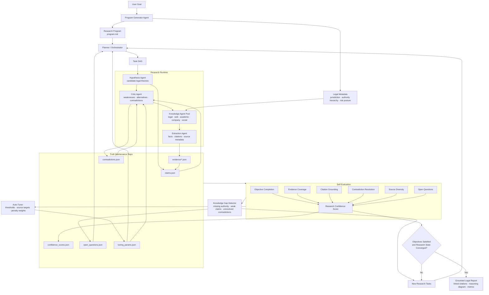

# AutoResearch OS

AutoResearch OS is a self-evaluating autonomous research runtime with a truth-maintenance repo. This hackathon prototype turns a user goal into an executable research program, runs an iterative control loop, stores every artifact in a truth-maintenance repo, evaluates convergence, detects knowledge gaps, and emits a grounded research report.

The key idea: do not optimize for an immediate answer. Optimize for a maintained research state with evidence, contradictions, confidence scores, and explicit stop conditions.

This version is intentionally narrowed to legal research. `program.md` includes legal-domain metadata such as jurisdiction, practice area, authority hierarchy, required legal source types, risk posture, citation policy, and uncertainty policy.

## Why This Fits The Hackathon

The Autoresearch Systems Hackathon asks for systems that help agents iteratively plan, search, and synthesize information over extended horizons. This repo focuses on:

- Agent architectures and control loops
- Retrieval and knowledge synthesis
- Citation-grounded reports
- Self-evaluation and stopping criteria
- A persistent truth-maintenance repository

## Architecture

### High-Level Flow


### Detailed Runtime



## Quickstart

```bash
python -m venv .venv
source .venv/bin/activate
pip install -e ".[dev]"

autoresearch run \
  "Can AI-generated code be copyrighted in the United States, and what legal risks would a startup face if it relies heavily on AI-generated software?" \
  --out gt_repo \
  --max-iterations 4
```

Or without installing:

```bash
PYTHONPATH=src python -m autoresearch_os.cli run \
  "Can AI-generated code be copyrighted in the United States?" \
  --out gt_repo
```

## Outputs

Each run writes a complete research state:

```text
gt_repo/
  program.md
  legal_metadata.json
  tuning_params.json
  tasks.json
  entities.json
  hypotheses.json
  claims.json
  evidence/
  contradictions.json
  confidence_scores.json
  metrics.json
  open_questions.json
  evals/
  final_report.md
  final_report.html
  final_report.pdf
```

## Legal Metadata And Tuning

Legal research quality depends on different assumptions than generic web research. AutoResearch OS records those assumptions in `program.md` and `legal_metadata.json`:

- Jurisdiction and practice area
- Legal authority hierarchy
- Required primary source types
- Citation style
- Risk posture and uncertainty policy

Several runtime constants are tunable and persist in `tuning_params.json`:

- `supported_claim_threshold`
- `contradiction_penalty_weight`
- `min_primary_sources`
- `target_source_diversity`
- `gap_task_limit`
- `evaluator_weights`

After each evaluation, the tuner nudges these values when the research state is weak. For example, low citation grounding raises the claim-support threshold and primary-source requirement; low contradiction resolution increases the contradiction penalty; too many open questions expands gap-task generation.

## Final Metrics And Reports

Every completed run emits `metrics.json`, adds a run metrics section to `final_report.md`, and generates both `final_report.html` and `final_report.pdf`. The HTML report is the clean demo artifact: it includes linked paper-style citations, a reasoning/rationale diagram, component-level metrics, hypothesis confidence, contradiction analysis, and source anchors. The metrics include:

- Number of agents spun off
- Agent-by-agent invocation breakdown
- Number of hypotheses generated
- Number of tasks, claims, evidence records, source categories, contradictions, and open questions
- Iterations completed
- Runtime in seconds
- Final confidence and stop-condition status

## Demo

```bash
PYTHONPATH=src python -m autoresearch_os.cli demo --out demo_gt_repo
```

Then open `demo_gt_repo/final_report.md`.

## Current Prototype Scope

This implementation ships with deterministic baseline agents so it can run live without API keys or network access. The knowledge layer includes a small legal-domain evidence fixture for the demo query and a general extraction path for local seed text. The agent interfaces are intentionally narrow, making it straightforward to swap in web search, legal search, academic search, OpenAI model calls, or Modal fan-out workers.

## Modal Hook

`modal/app.py` contains a lightweight Modal entrypoint sketch for parallel evidence collection. It is intentionally isolated so the local demo remains dependency-free.

## Development

```bash
pytest
```
