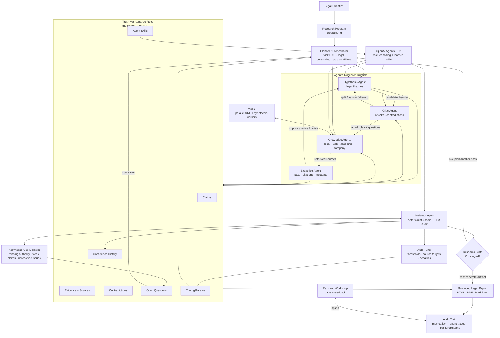
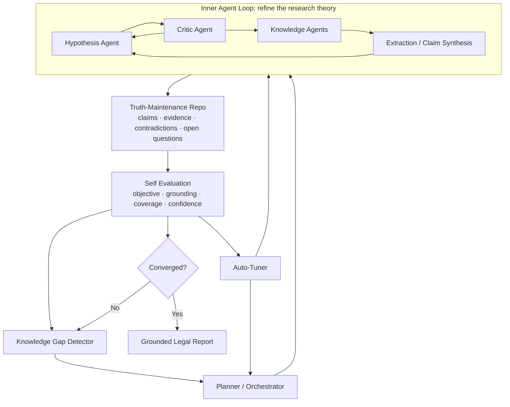
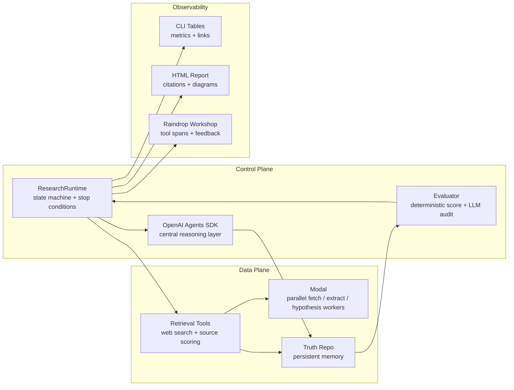

# Legal AutoResearch OS

Legal AutoResearch OS is an autonomous legal research control system built for the Modal Autoresearch Systems Hackathon. It turns a legal question into an executable `program.md`, runs tool-using agents through hypothesis/evidence/critic feedback loops, maintains a persistent truth-maintenance repo, evaluates convergence, and emits a grounded legal memo with linked citations, metrics, and a reasoning trace.

The project is intentionally narrowed to legal research because legal work rewards the exact properties autoresearch systems need: explicit objectives, authority hierarchy, source grounding, contradiction handling, uncertainty, and auditability. Each run records legal metadata such as jurisdiction, practice area, controlling authority, required source types, citation policy, risk posture, and uncertainty policy.

## Hackathon Pitch

Most research agents produce an answer. Legal AutoResearch OS produces a research state that can explain why the answer is trusted, what evidence supports it, what contradictions remain, and why the system stopped.

The core innovation is the control loop:

```text
Legal Question
  -> Research Program
  -> Hypothesis / Knowledge / Critic Agent Loop
  -> Truth Maintenance Repo
  -> Self Evaluation
  -> Knowledge Gap Detection
  -> New Tasks
  -> Research Again Until Converged
  -> Grounded Legal Memo
```

This is not just "an agent with memory." It is a research operating system where planning, control, memory, retrieval, evaluation, and reporting are first-class components.

## What Judges Should Notice

- Planning innovation: legal questions are compiled into `program.md` with objectives, scope, jurisdiction, authority hierarchy, required source types, and stop conditions.
- Control innovation: the runtime has both an inner hypothesis/knowledge/critic feedback loop and an outer evaluation/gap-detection loop.
- Memory innovation: the truth-maintenance repo persists claims, evidence, contradictions, confidence, open questions, tuning parameters, and learned agent skills.
- Agentic architecture: agents are explicit role workers with tools, traces, LLM reasoning calls, and measurable outputs, not anonymous threads.
- End-to-end autoresearch: the system plans, retrieves, reasons, criticizes, scores, detects gaps, tunes itself, and generates a cited report without manual stitching.
- Systems integration: OpenAI Agents SDK provides role reasoning, Modal accelerates distributed retrieval/agent work, and Raindrop traces the research loop for auditability.

## Quickstart

Install the project:

```bash
python -m venv .venv
source .venv/bin/activate
pip install -e ".[dev]"
```

Run the built-in legal demo with OpenAI Agents SDK reasoning:

```bash
export OPENAI_API_KEY="..."
autoresearch demo --out demo_gt_repo
```

`OPEN_API_KEY` is also accepted for local experiments. OpenAI Agents SDK reasoning is the default; if no key is available, the CLI fails loudly instead of silently falling back.

Run without installing:

```bash
export OPENAI_API_KEY="..."
PYTHONPATH=src python -m autoresearch_os.cli demo --out demo_gt_repo
```

Run deterministic fallback mode for offline tests or no-key demos:

```bash
PYTHONPATH=src python -m autoresearch_os.cli demo --offline --no-llm --out demo_gt_repo
```

Trace a local run in Raindrop Workshop:

```bash
pip install -e ".[dev,raindrop]"
raindrop workshop setup
PYTHONPATH=src python -m autoresearch_os.cli demo --offline --no-llm --raindrop --out demo_gt_repo
```

Workshop shows the research loop as tool spans: program generation, planning, hypothesis generation, retrieval, claim synthesis, criticism, evaluation, tuning, and report generation. This is the easiest way to inspect why confidence changed or why a source was blocked.

Control the inner hypothesis/knowledge/critic feedback loop:

```bash
PYTHONPATH=src python -m autoresearch_os.cli demo --feedback-rounds 2 --out demo_gt_repo
```

Run your own legal question:

```bash
autoresearch run \
  "Can AI-generated code be copyrighted in the United States, and what legal risks would a startup face if it relies heavily on AI-generated software?" \
  --out gt_repo \
  --max-iterations 4
```

Add extra sources:

```bash
autoresearch run \
  "Can AI-generated code be copyrighted in the United States?" \
  --source-url https://www.example.com/legal-source \
  --out gt_repo
```

Run live retrieval on Modal for faster source fan-out:

```bash
pip install -e ".[dev,modal]"
modal setup
export OPENAI_API_KEY="..."
autoresearch demo --modal --out demo_gt_repo
```

For a fast retrieval-only smoke test:

```bash
modal run modal/app.py
```

## Architecture

### High-Level Architecture



Read this diagram from the center out. The truth-maintenance repo is the system memory. Agents read from it, write to it, and are evaluated against it. The system does not stop because an LLM produced prose; it stops only when the evaluator says the research state satisfies objective completion, citation grounding, evidence coverage, contradiction resolution, source diversity, confidence stability, and open-question gates.

### The Two Feedback Loops



There are two loops:

- Inner agent loop: hypothesis, critic, knowledge, and extraction agents refine the current legal theory before evaluation.
- Outer control loop: evaluation, knowledge-gap detection, planning, and auto-tuning decide whether to run another research pass.

`--feedback-rounds` controls additional contradiction-driven refinement inside the inner loop. Ordinary open questions become follow-up tasks in the outer loop so the runtime does not repeat expensive retrieval work unnecessarily.

### Control Plane, Data Plane, And Observability



This split is deliberate. The local orchestrator owns legal state, stop conditions, and reproducibility. Modal is used for bounded parallel work. OpenAI Agents SDK is used for role reasoning. Raindrop is used to make the whole process inspectable during demos.

## Judging Criteria Mapping

### Innovation In Planning

Legal AutoResearch OS compiles a natural-language legal question into an executable research program instead of sending the question directly to a chat agent. The generated `program.md` captures:

- legal objective and sub-questions
- jurisdiction, practice area, and governing authority hierarchy
- source requirements such as statutes, agency guidance, cases, policy documents, and secondary sources
- risk posture and uncertainty policy
- evaluator thresholds and stop conditions

This gives the runtime a contract to satisfy. The planner converts that contract into a task DAG, then the knowledge-gap detector adds new tasks when evaluation finds missing authority, thin evidence, unresolved contradictions, or weak citation grounding.

### Innovation In Agent Control

The runtime separates role reasoning from orchestration. `ResearchRuntime` owns the state machine, while role agents execute bounded steps with explicit goals, tools, learned skills, traces, and OpenAI Agents SDK reasoning calls:

- `hypothesis_agent` proposes legal theories and expected evidence.
- `critic_agent` attacks claims and surfaces contradictions.
- `knowledge_agent_pool` retrieves and scores evidence.
- `hypothesis_refinement_agent` revises theories from critic output and new evidence.
- `evaluator_agent` audits whether the research state satisfies the program.
- `auto_tuner` changes thresholds and retrieval requirements over time.

Control is measurable. The system records iteration status, confidence deltas, evidence counts, contradiction counts, open questions, blocked sources, and component runtimes. It stops only when convergence criteria are met or a plateau is detected.

The novelty is that "agent" does not mean "thread." A programming thread only runs code concurrently. A Legal AutoResearch OS agent has a role contract, a tool set, learned skills, bounded LLM reasoning, structured inputs/outputs, and a trace. The orchestrator can compare their outputs, route failures into new tasks, tune thresholds, and decide whether the whole research state has converged.

### Innovation In Memory

Memory is not a chat transcript. Each run creates a truth-maintenance repo that acts like a structured research database:

- `claims.json` stores claim text, confidence, and supporting evidence ids.
- `evidence/*.json` stores source metadata, excerpts, reliability, relevance, and citation anchors.
- `contradictions.json` stores conflicts and resolution status.
- `open_questions.json` stores unresolved gaps for future planning.
- `confidence_scores.json` stores convergence history.
- `tuning_params.json` stores adaptive constants.
- `agent_skills.json` stores learned retrieval, critique, and refinement behaviors for future queries.

This makes research auditable and resumable. A teammate can inspect why a claim was supported, which source was used, which contradiction was unresolved, and which gate prevented convergence.

### End-To-End Autoresearch Innovation

The system performs the full research lifecycle:

```text
Question
  -> legal program generation
  -> task planning
  -> hypothesis generation
  -> live retrieval / Modal fan-out
  -> evidence extraction and source scoring
  -> claim synthesis
  -> critique and contradiction detection
  -> hypothesis refinement
  -> convergence evaluation with LLM audit
  -> knowledge-gap planning
  -> auto-tuning
  -> cited HTML / PDF / Markdown report
```

The generated report is part of the research system, not a cosmetic export. It includes the user query, short answer with linked citations, source table, reasoning/rationale diagram, component metrics, convergence progress, agent tool loops, contradictions, open questions, and Raindrop feedback when tracing is enabled.

### Integration Story

- OpenAI Agents SDK: provides the central role-reasoning layer. Each role receives structured state and returns bounded JSON reasoning, keeping LLM output inspectable instead of free-form.
- Modal: accelerates the data plane with parallel URL fetch/extract work and hypothesis-agent workers while the local orchestrator keeps control of truth state and convergence.
- Raindrop: provides demo-time observability. Each major phase is traced as a span so judges can inspect what happened, where time was spent, and why the evaluator trusted or rejected the result.

## Agents

The current runtime exposes these agent roles:

- `program_generator`: creates the legal research program and metadata.
- `planner_orchestrator`: turns the program into task structure.
- `hypothesis_agent`: generates and refines candidate legal theories.
- `hypothesis_refinement_agent`: revises hypotheses from critic findings, contradictions, and knowledge gaps.
- `knowledge_agent_pool`: retrieves and structures evidence from live or fallback sources.
- `modal_url_fetch_agent`: when `--modal` is enabled, fans out URL fetch/extract jobs on Modal.
- `critic_agent`: attacks claims, finds contradictions, and raises weaknesses.
- `evaluator_agent`: scores the research state against convergence criteria.
- `knowledge_gap_detector`: creates follow-up tasks from weak or missing knowledge.
- `auto_tuner`: adjusts thresholds and source requirements over time.
- `report_generator`: produces Markdown, HTML, and PDF reports.

Each role agent has deterministic tools plus an OpenAI Agents SDK reasoning call. The local runtime owns orchestration and state, while SDK `Agent` instances perform the compact JSON reasoning steps for hypothesis refinement, evidence review, and criticism. Agent traces are written into `metrics.json` and shown in the CLI and HTML report, including tools used, loop steps, output counts, and whether LLM reasoning was used.

Agent behavior is stateful across runs through learned skills. At run start, the runtime loads `agent_skills.json` from the parent output directory, merges it with default skills, and passes the relevant skill list into the agent's OpenAI Agents SDK prompt as `learned_skills`. At run end, the skill memory is updated from the evaluator result, blocked retrievals, weak citation grounding, unresolved contradictions, and open questions.

In practical terms:

- With LLM reasoning enabled, skills are active instructions that affect hypothesis refinement, evidence review, critique, and Modal hypothesis-agent behavior.
- With `--no-llm`, skills are still loaded, snapshotted, and updated, but deterministic fallback tools only use a smaller fixed behavior set. Offline mode is therefore reproducible, while full agent skill adaptation happens through the OpenAI Agents SDK layer.
- Every run writes its active skill snapshot into the truth-maintenance repo so judges can inspect what each agent knew during that run.

## Truth-Maintenance Repo

Each run writes a complete research state:

```text
gt_repo/
  program.md
  legal_metadata.json
  tuning_params.json
  tasks.json
  entities.json
  hypotheses.json
  claims.json
  evidence/
  contradictions.json
  confidence_scores.json
  metrics.json
  raindrop_feedback.json
  open_questions.json
  evals/
  final_report.md
  final_report.html
  final_report.pdf
```

The HTML report is the primary demo artifact. It includes paper-style linked citations, a reasoning/rationale diagram, component-level metrics, convergence progress, hypothesis confidence, contradiction analysis, source anchors, and agent tool loops.

## Retrieval

Knowledge agents can fetch real external sources using dependency-free HTTP retrieval. For live runs, the retrieval planner builds legal web-search queries from the objective and hypotheses, expands blocked search results with curated legal-source fallbacks, deduplicates candidate URLs, fetches sources, and assigns relative reliability/relevance scores. Copyright-specific built-ins are used only for copyright/authorship questions.

Every run records retrieval metrics:

- live retrieval enabled or disabled
- web search enabled, search queries, and discovered URLs
- URLs attempted and retrieved
- relative source scores
- failed URLs and error classes
- Modal URL fetch-agent count when `--modal` is enabled
- fallback evidence usage
- retrieved source URLs

## Evaluation And Convergence

The evaluator tracks:

- objective completion
- evidence coverage
- citation grounding
- contradiction resolution
- source diversity
- open questions
- final confidence

Scoring has two layers:

1. A deterministic base score combines objective completion, evidence coverage, source diversity, contradiction resolution, citation grounding, mean claim confidence, primary-authority coverage, and confidence stability. It subtracts penalties for open questions and blocked sources, then applies confidence caps for thin or weak evidence.
2. When LLM reasoning is enabled, the central `evaluator_agent` performs a bounded scoring audit. It checks whether the claims actually answer the objective and whether cited excerpts support those claims. The LLM can adjust the deterministic score by at most `-8%` to `+4%`, and positive adjustments are blocked when open questions remain.

The report and `metrics.json` record deterministic confidence, LLM adjustment, final confidence, and the LLM scoring rationale when the audit runs.

The runtime stops when the research program is satisfied:

```text
Objective Completion >= 90%
Citation Grounding >= 90%
Overall Confidence >= 85%
Critical Open Questions <= 2
Contradiction Resolution >= 80%
```

If the state has not converged, the knowledge-gap detector creates follow-up tasks and the runtime loops again.

The runtime also stops early when the research state plateaus: if confidence, evidence count, and open-question count stop improving, the iteration status becomes `Plateau` and the report is generated instead of spending more time on repeated retrieval.

## Legal Metadata And Tuning

Legal quality depends on different assumptions than generic web research. Legal AutoResearch OS records those assumptions in `program.md` and `legal_metadata.json`:

- jurisdiction and practice area
- legal authority hierarchy
- required primary source types
- citation style
- risk posture and uncertainty policy

The runtime persists tunable constants in `tuning_params.json`, including:

- `supported_claim_threshold`
- `contradiction_penalty_weight`
- `min_primary_sources`
- `target_source_diversity`
- `gap_task_limit`
- `evaluator_weights`

After each evaluation, the tuner nudges these values when the research state is weak. For example, low citation grounding raises the support threshold and primary-source requirement; low contradiction resolution increases contradiction penalties; too many open questions expands gap-task generation.

## Metrics

The CLI, `metrics.json`, Markdown report, HTML report, and PDF report include:

- agents spun off and agent-by-agent breakdown
- hypotheses, tasks, claims, evidence records, source categories, contradictions, and open questions
- iterations completed
- component runtimes
- retrieval metrics
- agent tool-loop traces
- Raindrop tracing status
- Raindrop feedback verdict and next-step recommendations
- final confidence
- stop-condition status

## Agent Skill Learning

Agents improve across queries through a persistent `agent_skills.json` file written beside your run directories. Each run snapshots the active skills into its truth-maintenance repo as `agent_skills.json`, then updates the shared skill memory from convergence results, blocked retrievals, citation grounding, contradictions, and open questions.

Those learned skills are active when LLM reasoning is enabled. They are fed into future OpenAI Agents SDK prompts as `learned_skills` for:

- `hypothesis_agent`
- `knowledge_agent_pool`
- `critic_agent`
- `hypothesis_refinement_agent`
- `modal_hypothesis_agent`

Examples of learned skills include:

- replace blocked or low-signal retrieval with accessible primary authority
- avoid treating blocked pages as evidence
- require primary authority before marking a claim citation-grounded
- map unresolved open questions back to the exact claim or hypothesis they can repair
- resolve contradictions by separating legal categories, factual assumptions, and source authority

This is intentionally implemented as prompt-level skill memory rather than hidden mutation of deterministic tools. That makes the behavior explainable during a demo: the report and truth repo can show both the learned skills and the agent traces that used them.

In offline `--no-llm` mode, the same skills are still loaded, snapshotted, and updated, but they have limited effect because deterministic fallback tools do not run the OpenAI Agents SDK reasoning layer.

The shared `agent_skills.json` is intentionally ignored by git because it is local run memory. Delete it to reset learned behavior.

## Raindrop Workshop Tracing

Raindrop Workshop is optional, but it is the best debugging surface for the whole control loop. When `--raindrop` is enabled, Legal AutoResearch OS records each major research phase as a Raindrop tool span. Useful spans include:

- `program_generator`
- `planner_orchestrator`
- `hypothesis_agent`
- `knowledge_agent_pool`
- `claim_synthesis`
- `critic_agent`
- `knowledge_gap_detector`
- `hypothesis_refinement_agent`
- `evaluator_agent`
- `auto_tuner`
- `raindrop_feedback_agent`
- `report_generator`

For example, the `knowledge_agent_pool` span records URL attempts, retrieved URLs, blocked/CAPTCHA sources, and fallback usage. The `evaluator_agent` span records confidence, citation grounding, primary-authority coverage, blocked-source penalty, and confidence cap. This makes Raindrop useful for explaining why the system trusted or distrusted a research result.

After evaluation, the `raindrop_feedback_agent` turns the trace-shaped metrics into a concrete feedback artifact. It writes `raindrop_feedback.json`, adds a Raindrop Feedback section to the report, and recommends next-run actions such as enabling live retrieval, adding source URLs, increasing iterations, or inspecting specific Workshop spans.

## Modal Acceleration

`modal/app.py` defines the remote workers used by `autoresearch demo --modal` and `autoresearch run --modal`. The default accelerated path is URL-level retrieval fan-out: the local orchestrator plans queries and candidate URLs, Modal workers fetch/extract those URLs in parallel, and the local runtime deduplicates evidence before claim synthesis, critique, evaluation, and reporting. This uses Modal for the network-bound part of the system without paying remote orchestration overhead for every hypothesis on every feedback round.

The design follows the same control-plane/data-plane split as [`modal-labs/openai-agents-python-example`](https://github.com/modal-labs/openai-agents-python-example): keep an orchestrator in charge of state, then fan out bounded worker jobs on Modal. In this repo, `ResearchRuntime` is the orchestrator, `modal_url_fetch_agent` is the distributed retrieval worker pool, and `modal/app.py` is the remote worker layer.

Modal is optional:

- Default local retrieval stays dependency-free.
- `--modal` requires `pip install -e ".[modal]"` and `modal setup`.
- If Modal is unavailable, the CLI exits with a clear error instead of silently switching paths.

See [docs/modal_agents_reference.md](docs/modal_agents_reference.md) for the mapping between the reference project and this legal research runtime.

## Development

```bash
pytest
```
