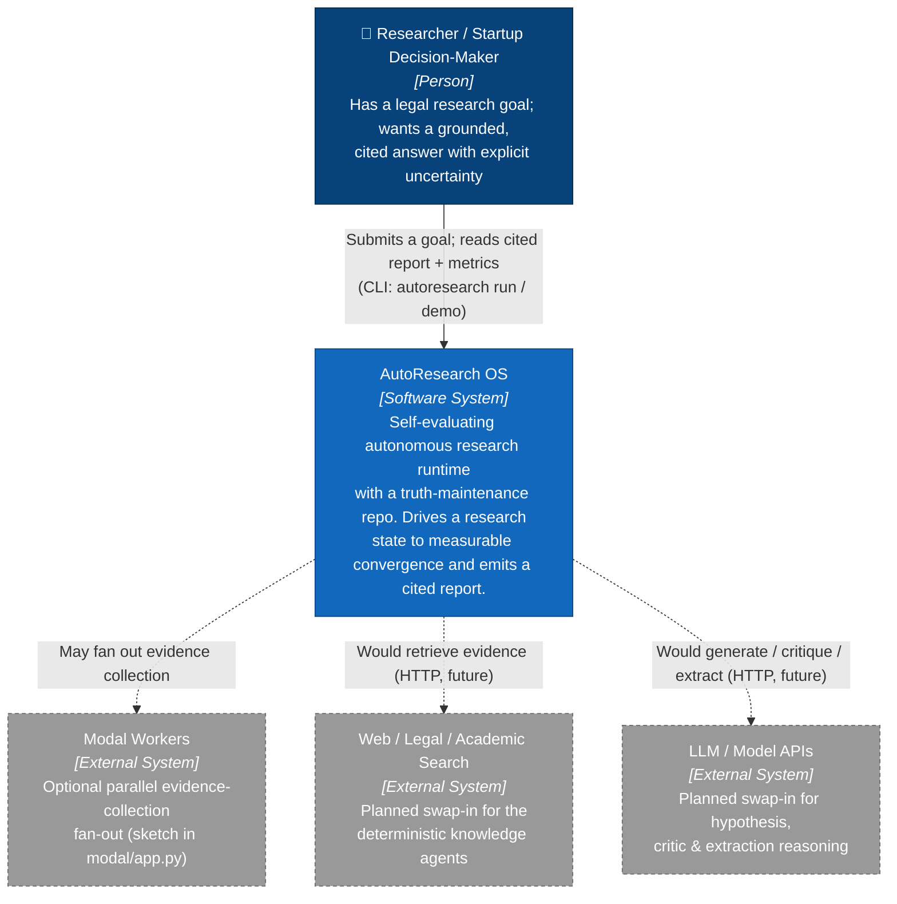
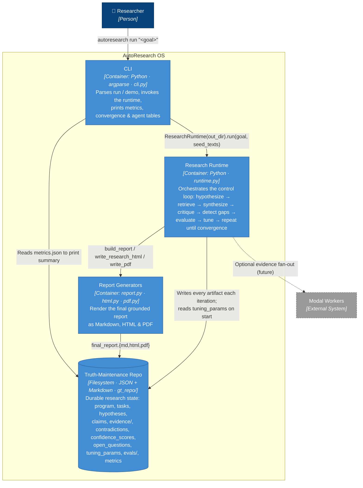
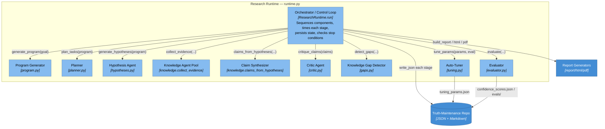
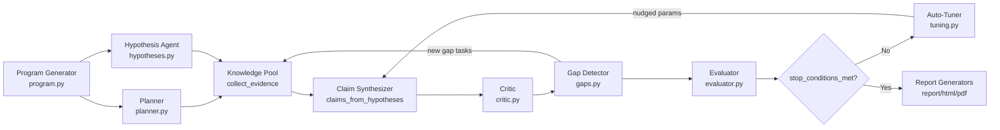
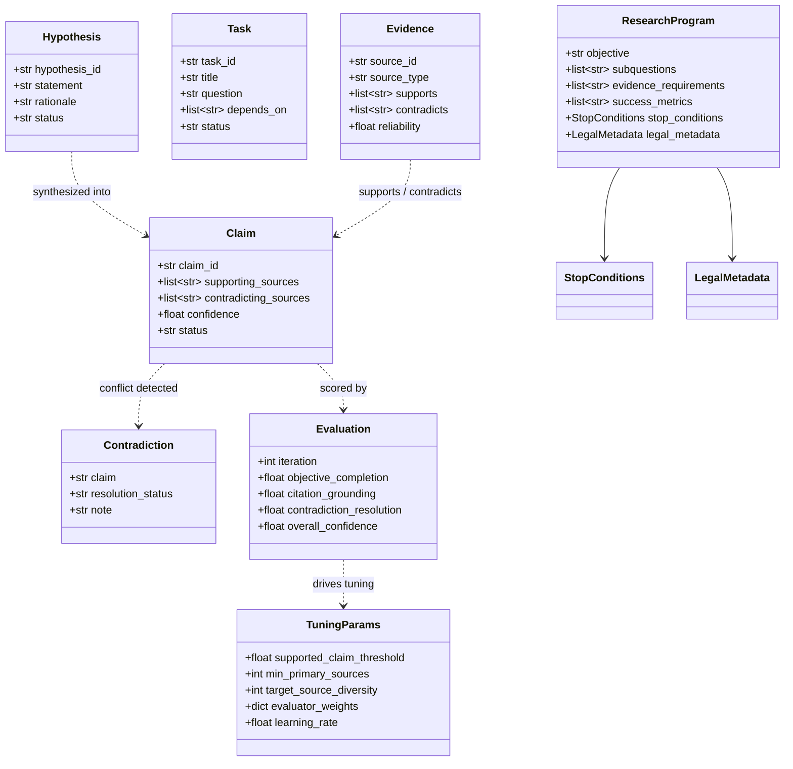
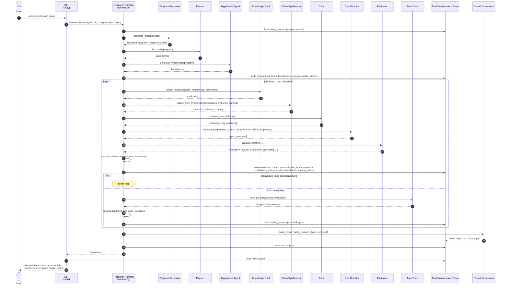

# AutoResearch OS — C4 Model & Sequence Diagrams

This document describes the architecture of **AutoResearch OS** using the
[C4 model](https://c4model.com/) (Context → Container → Component → Code) plus a
runtime **sequence diagram** of the research control loop.

All diagrams are Mermaid and render in GitHub and in VS Code's Markdown preview
(with the **Markdown Preview Mermaid Support** extension). The C4 levels use
standard `flowchart` syntax — color-coded by C4 element type — rather than
Mermaid's experimental `C4Context`/`C4Container` diagrams, which the bundled
renderer leaves blank.

> Mapping note: every component below corresponds to a real module under
> `src/autoresearch_os/`. The runtime is fully deterministic and offline today —
> "knowledge agents" read a built-in legal fixture (`knowledge.py`) plus optional
> seed text; the external search/LLM systems shown dashed are the documented
> swap-in points, not current dependencies.

---

## Level 1 — System Context

Who uses the system and what it talks to.

---

## Level 2 — Containers

The high-level building blocks inside AutoResearch OS and the shared
truth-maintenance repository they all read from / write to.

---

## Level 3 — Components (inside the Research Runtime)

Each component is one module. Arrows show the data-flow of a single iteration of
the control loop. The runtime (`runtime.py`) is the orchestrator that calls each
component in order and persists the result.

### Component responsibilities & control-flow feedback

---

## Level 4 — Code (key types)

The contracts passed between components live in `models.py` (dataclasses).

---

## Sequence Diagram — One Research Run

End-to-end flow for `autoresearch run "<goal>"`, including the iterative loop and
its convergence check. The loop body matches `ResearchRuntime.run` in
`runtime.py`.

### Convergence stop conditions

The loop breaks early when **all four** hard gates pass — see
`stop_conditions_met` in `evaluator.py` against `StopConditions` in `models.py`:

| Gate | Threshold |
|------|-----------|
| Overall confidence | ≥ 85% |
| Citation grounding | ≥ 90% |
| Objective completion | ≥ 90% |
| Open questions | ≤ 2 |

> Note: contradiction resolution (≥ 80%, mentioned in the README) is **not** a
> hard stop gate in the code. It is one of the weighted inputs the evaluator
> folds into `overall_confidence`, so it influences convergence indirectly
> rather than blocking it directly.

If the gates are not met, the gap detector's open questions become new tasks, the
auto-tuner nudges thresholds, and the runtime loops again (up to
`--max-iterations`).
